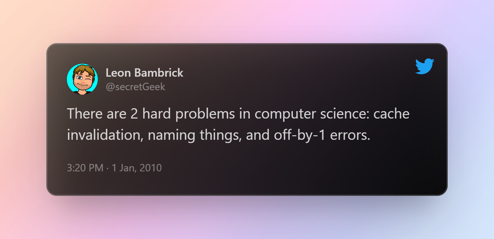
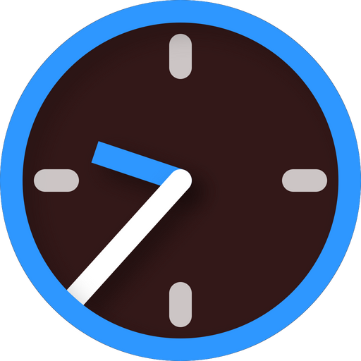

Hi there! 👋
I'm a **Theoretical Computer Science** student at the Jagiellonian University, **Kraków, Poland**. I spend my free time making *things*. The *things* include mostly programming projects, but I'm also interested in electronics and 3d printing. Check out a list of some of the *things* that I made or contributed to:

## 🌐 [plan.dk-gl.eu](https://plan.dk-gl.eu) - [[Source](https://github.com/dominik-korsa/timetable)]

This is a school timetable app - it can load and parse VULCAN Optivum timetables (using [another project of mine](https://github.com/wulkanowy/timetable-parser-js)) or load data from an [API for V High School in Kraków timetable](https://github.com/cloud11665/vlott).

### Technologies and features:
- **Fully responsive** and **mobile first** - works great on mobile and on desktop
- Very **customizable** - users can select their groups, hide lessons they don't attend, choose favourite classes change the color scheme and more
- Has a built-in [**classroom map**](https://plan.dk-gl.eu/v-lo/room) for the V High School. 
- Has a **combined view**, where a user can see the timetables of all the classes at once
- Build using **Vue 3** and **Quasar**
- Progressive Web App (**PWA**)
- **Caching** - timetable data is stored locally so the app works even when offline and loads almost instantly

## 📱 [Wulkanowy](https://wulkanowy.github.io/) - [[Source](https://github.com/wulkanowy/wulkanowy/blob/develop/README.en.md)]

A mobile app, with over **1 million downloads on Google Play** for accessing VULCAN Uonet+ school registers. This is quite a big project with over 20 contributors.

I've also worked on related projects, like the timetable parser mentioned before, a Discord bot for the Wulkanowy community and the project's website. 

## 🎮 [Discord Integration](https://www.spigotmc.org/resources/discord-integration.91088/) - [[Source](https://github.com/dominik-korsa/discord-integration)]

A plugin for [Spigot](https://www.spigotmc.org/) servers that allows to sync messages in a Discord server and Minecraft chat.

Very customizable, has almost **3000 downloads**. Check the [listing on Spigot Hub](https://www.spigotmc.org/resources/discord-integration.91088/) for a list of features.

Written in **Kotlin**, uses **Discord4j**, makes use of **Kotlin coroutines**.

## 💻 Face Shield - [[Source](https://github.com/szczurzy-torpedowiec/faceshield)]

Desktop app that detects when you touch your face, using a webcam or a Xbox Kinect. When you do that, it plays a sound and shows an alert on the screen. 

Used technologies: **Electron**, **Vue.js**, **Vuetify**, **TensorFlow.js**.

This app was made as a submission for the [Hack Heroes](https://hackheroes.pl/) programming contest, where it won **🥇 first place**.

## 🌐 [Boardflow](https://boardflow.doteq.cf/) - [[Source](https://github.com/doteq/boardflow)]

A collaborative web app, where students can add upcoming lessons, homework, tests and quizzes to a shared calendar. Created due to the ineffectiveness of school organization during the lockdowns caused by COVID-19.

### Technologies and features:
- Made in **Vue.js** and **Vuetify**
- Uses **Firebase Firestore** as a real-time database
- Uses **Firebase Auth** for signing in with Google or Facebook accounts
- Has **🇵🇱 Polish** and **🇬🇧 English** translations

## 🔧 [No Liblink](https://chrome.google.com/webstore/detail/no-liblink/eljkcbiebkmpkkccdlmookjjliefneep?hl=pl) - [[Source](https://github.com/dominik-korsa/no-liblink)]

A browser extension which automatically replaces annoying `liblink.pl` links with the URL they are redirecting to in the Librus Synergia school register.

Published in [Chrome Web Store](https://chrome.google.com/webstore/detail/no-liblink/eljkcbiebkmpkkccdlmookjjliefneep?hl=pl)

## 🌐 [Dżamnikowa Informatyka](https://dzamnikowa-informatyka.web.app/) - [[Source](https://github.com/dominik-korsa/dzamnikowa-informatyka)]
A web app for creating resources to teach programming. Teachers can create materials and exercises, written in markdown. Students can send back their solutions to the exercises, which are then graded by a teacher.

### Technologies and features:
- Made in **Vue.js** and **Vuetify**
- Uses **Firebase Firestore** as a real-time database
- Uses **Firebase Auth** for signing in with Google or Facebook accounts
- Uses **Firebase Cloud Messaging** for push notifications

## 🌐 [Game Auction](https://auction.dk-gl.eu/) - [[Source](https://github.com/dominik-korsa/game-auction)]
An app for realtime bidding, useful for tabletop games like Monopoly. Supports three types of auctions:
- **English** - classic auction type. Players place their bids and see the bids of others in real time
- **Dutch** - the price gets lower as time passes, until someone accepts the current price.
- **Sealed-bid** - players bid once, without seeing the offers of other bidders. The player who bids the highest price wins.

Uses **Vue.js**, **Vuetify** and a custom **Socket.IO** backend.

## 🌐 [New Year Countdown](https://dominik-korsa.github.io/new-year-countdown/) - [[Source](https://github.com/dominik-korsa/new-year-countdown)]
A web app that counts down to midnight, January 1st. That's it!
